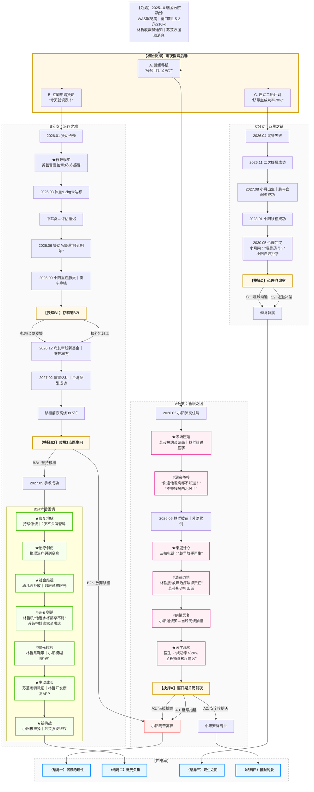

# S
【场景】
诊室弥漫消毒水与旧纸张混合的气味。百叶窗缝隙漏进秋雨天的灰光。小阳蜷在苏芸臂弯里，手腕贴着退热贴，呼吸微弱。林哲西装肩线被雨水洇出深痕，指节无意识敲击塑料椅扶手——节奏精准如代码编译。

陈医生摘下金丝眼镜，用白大褂下摆慢擦镜片。诊断报告摊在桌面，"Wiskott-Aldrich综合征"七个字被红笔圈了三圈。

陈医生：（声音压低）  
"免疫系统先天缺陷，血小板只有正常值十分之一。昨天验血，小阳又出血点了。"  
（指尖点向报告影像）  
"骨髓移植是唯一根治路。但窗口期卡得死——必须一岁半到两岁之间，体重超十公斤。现在才五点九公斤。"

苏芸：（喉头滚动，声音发颤）  
"成功率...能到多少？"

陈医生：（停顿三秒）  
"配型成功的话，六成。但术后大概率发育迟缓：智力可能停在三四岁，身高难超一米四，生活能否自理...看天意。"  
（抬眼直视林哲）  
"林先生，您是父亲，得听真话：移植过程孩子要经历三次大化疗，插管、感染风险、排异反应...每一步都是酷刑。"

林哲：（突然开口，语速平稳）  
"如果不做呢？"

诊室骤然寂静。窗外救护车鸣笛由远及近又消失。

陈医生：（叹息）  
"保守治疗只能拖时间。反复肺炎、颅内出血...多数孩子撑不过三岁。最后阶段会持续高烧、意识模糊..."  
（推过费用单）  
"移植总费用预估七十五万。医保报基础部分，自费至少五十万。"

【特写】  
- 林哲裤袋手机震动。屏幕亮起：【王总监】"明早10点部门会，全员到岗（附：优化名单讨论）"  
  他拇指悬停三秒，静音塞回口袋。喉结滚动。  
- 苏芸手机在膝头亮起。病友群弹窗：  
  "芸姐！同心基金通道开了！但要外婆老家派出所盖居住证明！7天截止！"  
  她指尖冰凉，悄悄将手机翻扣在腿上。  

陈医生：（起身整理听诊器）  
"给你们半小时。走廊尽头有长椅。"  
（关门时轻声）  
"别怪孩子...是命太薄。"

【镜头拉远】  
苏芸低头吻小阳额头，泪水砸在孩子睫毛上。小阳无意识攥住她一缕头发。  
林哲盯着窗外雨幕，右手在桌下死死攥拳，指节泛白。左手却缓缓覆上苏芸颤抖的手背。  
雨滴在玻璃上蜿蜒如泪痕。  
诊室挂钟秒针：滴答、滴答、滴答...  

# D1 雨夜医院后巷
【场景】  
秋雨细密如针。苏芸单薄衬衫湿透，却把外套全裹住小阳。林哲撑开黑伞，伞骨明显倾向妻儿，右肩西装迅速洇出深色水痕。巷子垃圾桶旁堆着废弃输液袋，雨水冲刷着药渍。

苏芸：（声音发颤，盯着手机屏）  
“病友群说...同心基金要外婆老家派出所盖章。妈在安徽砀山，来回得三天..."  
（指尖划过屏幕）  
“可小阳昨天又出血点了...他等得起吗？”

林哲：（喉结滚动，删掉刚编辑的“收到”回复总监）  
“你上月请五天假，总监说再缺勤调去测试组。”  
（伞沿雨水砸在他睫毛上）  
“我项目奖金下月发，二十万。加上存款...等窗口期到了再筹钱，更稳妥。”

苏芸：（猛地抬头，雨水混着泪）  
“窗口期？医生说体重必须十公斤！他现在才五点九！等？等他肺炎第三次发作吗？”  
（怀中小阳无意识蹬腿，她慌忙拍背）  
“刚才在诊室...他攥我头发的样子..."

林哲：（突然攥紧伞柄，指节发白）  
“芸芸！就算现在做，六成成功率！术后他可能永远长不高、不会说话、要人喂饭擦身..."  
（声音陡然压低，带着撕裂感）  
“我们背五十万债，你工作没了，我明天可能被裁...全家拖垮，值得吗？”

【特写】  
- 苏芸瞳孔骤缩，抱紧小阳后退半步。婴儿背带勒进她肩胛。  
- 林哲话出口瞬间脸色煞白，喉间滚动三次才咽下后半句。  
- 小阳在睡梦中哼唧，小手无意识抓向母亲湿透的衣领。

林哲：（突然别过脸，声音沙哑如砂纸磨过）  
“...或者...再生一个。脐带血配型..."  
（话未说完猛地闭嘴，右手死死掐进左臂）  
“对不起。我混蛋。”

苏芸：（浑身发抖，却把伞往林哲那边推）  
“他听见了...小阳刚才睁眼看你。”  
（低头吻孩子额头，声音轻得像叹息）  
“他那么小的手...攥我头发时，像在说‘妈妈别怕’。”

【长镜头】  
林哲僵立原地。雨水顺着他下颌线滴进衣领。他缓缓蹲下，平视熟睡的小阳。  
指尖悬在孩子脸颊上方三厘米，终究没敢触碰。  
伞彻底倾向苏芸母子，他半边身子淋在雨里，肩线微微发颤。

林哲：（抬头看苏芸，眼底血丝密布）  
“芸芸...你说。这次，听你的。”  
（伞沿雨水连成珠帘，隔开两人模糊的泪眼）  
“但别骗我...也别骗你自己。”

【收尾】  
巷口救护车呼啸而过，红光扫过三人剪影。  
苏芸张了张嘴，喉间哽咽无声。  
怀中小阳忽然咧嘴笑，无意识吐出奶泡泡。  
雨声吞没所有言语。  